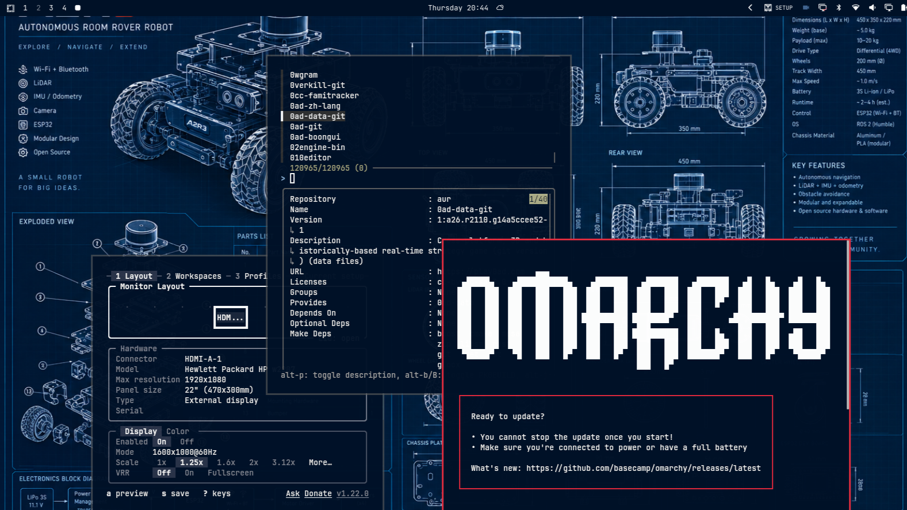

# A2R3 Blueprint

**An Omarchy theme drawn straight from an engineering blueprint.** Deep navy, pure white text, one red accent.


<!--  -->


## Why this exists

Most dark themes are grey, or a little too colorful. This one is a rover blueprint: a navy sheet, crisp white linework, and a single red mark. The background color was sampled from the A2R3 (Autonomous Room Rover Robot) spec sheet, and the accent comes from the red **3** in its logo.

Terminals, shells and TUI apps use the same navy and white as the wallpaper, so text reads like drafting-table annotation and nothing distracts from the code.

## Install

One command:

```bash
omarchy-theme-install https://github.com/migit/omarchy-a2r3-blueprint-theme.git
```

Or from the menu: press `Super + Space`, then **Install > Style > Theme** and paste the repo URL.

Apply it manually if it's already installed:

```bash
omarchy-theme-set "a2r3-blueprint"
```

## Palette

| Role       | Hex       |
| ---------- | --------- |
| Background | `#001127` |
| Foreground | `#ffffff` |
| Accent     | `#e0283c` |
| Selection  | `#1c3d66` |
| Muted      | `#3f6390` |

The 16-color ANSI palette keeps white in both the `white` and `bright white` slots, so default text in the shell and TUIs stays white. The remaining slots are cool blues plus soft green, amber and violet, used only where an app colors things itself, such as git status or btop graphs.

## What's themed

- **Terminals:** Alacritty, Kitty, Ghostty
- **TUI:** btop, Neovim (tokyonight, recolored to match)
- **Desktop:** Hyprland borders, Hyprlock, Waybar, Walker, Mako, SwayOSD
- **Browser:** Chromium
- **Wallpaper:** the original A2R3 blueprint sheet, in `backgrounds/`

## Make it fully monochrome

Want everything white with no color at all? Run this in the theme folder:

```bash
cd ~/.config/omarchy/themes/a2r3-blueprint
sed -i -E 's/(6fc3df|9fe0f2|4a90d9|7ab8f5|4fd1a5|7ff0c8|f0c674|ffd98a|b58cf0|cfa8ff|ff5568)/ffffff/gI' *.conf *.toml *.theme *.css *.lua
omarchy-theme-set "a2r3-blueprint"
```

## Repo layout

```text
.
├── colors.toml        # palette Omarchy generates app themes from
├── backgrounds/       # wallpaper(s)
├── preview.png        # 16:9 preview
└── *.toml/.conf/.css  # per-app overrides
```

## Credits

- Wallpaper: A2R3 blueprint concept sheet, AI-generated artwork.
- Built for [Omarchy](https://github.com/omacom/omarchy).

## License

MIT. Fork it, recolor it, ship your own.

---

**BUILD / EXPLORE / IMPROVE**
